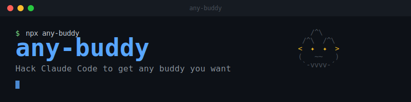

<p align="center">
  
</p>

<p align="center">
  <a href="https://www.npmjs.com/package/any-buddy"></a>
  <a href="https://github.com/cpaczek/any-buddy/actions"></a>
  <a href="LICENSE"></a>
  
</p>

<p align="center">
  Pick any Claude Code companion pet you want. Choose your species, rarity, eyes, hat, and name.
</p>

---

## Quick Start

```bash
npx any-buddy@latest
```

That's it. Follow the prompts.

<p align="center">
  
</p>

## Install

```bash
# npm (global)
npm install -g any-buddy

# or clone
git clone https://github.com/cpaczek/any-buddy.git
cd any-buddy && pnpm install && pnpm link --global
```

### Requirements

- **Node.js >= 20**
- **Bun** -- for hash computation (typically already installed with Claude Code)
- **Claude Code** -- installed via any standard method

### Platform Support

| Platform | Status | Notes |
|----------|--------|-------|
| Linux | Tested | Auto-detects `~/.local/share/claude/versions/` |
| macOS | Tested | Auto-detects + ad-hoc re-signs after patching |
| Windows | Tested | Works with npm-based installs (`cli.js`) |

> Set `CLAUDE_BINARY=/path/to/binary` if auto-detection fails.

## Usage

```bash
any-buddy                    # Interactive pet picker
any-buddy current            # Show your current pet
any-buddy preview            # Browse without applying
any-buddy apply              # Re-apply after Claude Code update
any-buddy restore            # Restore original pet
any-buddy rehatch            # Delete companion, re-hatch via /buddy
```

### Non-Interactive Mode

Skip prompts with flags:

```bash
any-buddy -s dragon -r legendary -e '✦' -t wizard --shiny --name Draco -y
```

<details>
<summary><strong>All CLI Flags</strong></summary>

| Flag | Short | Description |
|------|-------|-------------|
| `--species <name>` | `-s` | Species (duck, goose, blob, cat, dragon, octopus, owl, penguin, turtle, snail, ghost, axolotl, capybara, cactus, robot, rabbit, mushroom, chonk) |
| `--rarity <level>` | `-r` | Rarity (common, uncommon, rare, epic, legendary) |
| `--eye <char>` | `-e` | Eye style (` ·  ✦  ×  ◉  @  ° `) |
| `--hat <name>` | `-t` | Hat (crown, tophat, propeller, halo, wizard, beanie, tinyduck) |
| `--name <name>` | `-n` | Rename companion |
| `--personality <desc>` | `-p` | Set personality (controls speech bubble) |
| `--shiny` | | Require shiny (~100x longer search) |
| `--peak <stat>` | | Best stat (DEBUGGING, PATIENCE, CHAOS, WISDOM, SNARK) |
| `--dump <stat>` | | Worst stat |
| `--yes` | `-y` | Skip confirmations |
| `--no-hook` | | Don't offer auto-patch hook |
| `--silent` | | Suppress output (for hooks) |

</details>

## All 18 Species

<p align="center">
  
</p>

## Customization Options

<p align="center">
  
</p>

## Restoring

```bash
any-buddy restore
```

Patches the salt back to original, removes the auto-patch hook, and clears saved config.

## How It Works

See [HOW_IT_WORKS.md](HOW_IT_WORKS.md) for the full technical deep-dive on hashing, binary patching, the salt search algorithm, and the auto-patch hook.

## Known Limitations

- **macOS**: Binary is ad-hoc re-signed after patching. If Claude Code won't launch, run `any-buddy restore`
- **Bun required**: Needed for matching Claude Code's wyhash (auto-detected, usually already installed)
- **Salt dependent**: If Anthropic changes the salt string, the tool will detect this and warn you
- **Stats**: You pick peak/dump stats, but exact values are seed-determined

## Contributing

See [CONTRIBUTING.md](CONTRIBUTING.md) for development setup, project structure, and how to submit changes.

## Credits

- [@jtuskan](https://github.com/jtuskan) -- Windows support for npm-based installs ([#5](https://github.com/cpaczek/any-buddy/pull/5))
- [@aaronepinto](https://github.com/aaronepinto) -- macOS ad-hoc code signing ([#3](https://github.com/cpaczek/any-buddy/pull/3))
- [@joshpocock](https://github.com/joshpocock) -- FNV-1a hash support for Node runtime ([#8](https://github.com/cpaczek/any-buddy/pull/8))
- [@Co-Messi](https://github.com/Co-Messi) -- Multi-worker parallelism + early-exit optimization ([#11](https://github.com/cpaczek/any-buddy/pull/11))
- [@Ahmad8864](https://github.com/Ahmad8864) -- 8-core cap idea ([#10](https://github.com/cpaczek/any-buddy/pull/10))

## License

[WTFPL](LICENSE) -- Do What The Fuck You Want To Public License.
